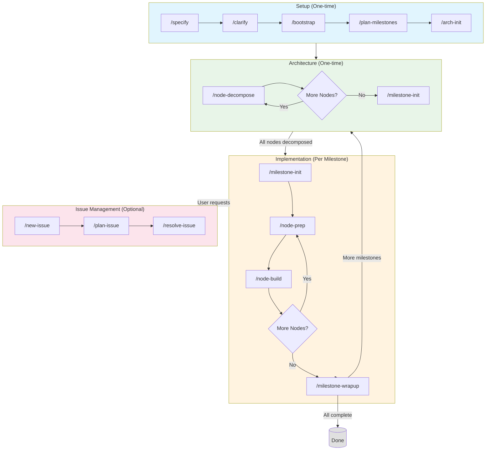

# Code Agent Toolkit

> A structural, frontier-driven workflow for building large software systems with AI agents — without collapsing into linear context overload.

---

## Overview

This toolkit provides a collection of Claude Code skills that implement a two-tier architectural model:

- **Outer Tier (Rare, Structural)**: Architecture decisions made infrequently
- **Inner Tier (Frequent, Local)**: Test-driven implementation of individual components

The workflow enforces strict TDD discipline and prevents context overload by keeping each iteration small, local, and bounded.

---

## Skills

### Specification & Planning

| Skill | Description |
|-------|-------------|
| [specify](skills/specify/) | Creates or updates project specifications (SPEC.md) |
| [clarify](skills/clarify/) | Resolves ambiguous areas in specifications through targeted questions |
| [bootstrap](skills/bootstrap/) | Bootstraps new projects with tech stack selection and hello-world baseline |
| [plan-milestones](skills/plan-milestones/) | Plans implementation milestones from specification |

### Architecture

| Skill | Description |
|-------|-------------|
| [arch-init](skills/arch-init/) | Initializes architecture documentation with root node |
| [node-decompose](skills/node-decompose/) | Decomposes architecture nodes into child components |
| [milestone-init](skills/milestone-init/) | Derives per-node feature requirements for current milestone |
| [node-prep](skills/node-prep/) | Prepares nodes with skeleton code and failing tests |
| [node-build](skills/node-build/) | Implements prepared nodes following TDD workflow |
| [milestone-wrapup](skills/milestone-wrapup/) | Verifies milestone completion and transitions to next milestone |

### Issue Management

| Skill | Description |
|-------|-------------|
| [new-issue](skills/new-issue/) | Creates feature request or bug report documents |
| [plan-issue](skills/plan-issue/) | Creates task roadmap with TDD discipline |
| [resolve-issue](skills/resolve-issue/) | Executes issue resolution in batches with review checkpoints |

---

## Workflow



### Setup (One-time per project)

```
specify → clarify → bootstrap → plan-milestones → arch-init
```

1. **specify**: Create SPEC.md with requirements
2. **clarify**: Resolve ambiguities
3. **bootstrap**: Select tech stack and create baseline project
4. **plan-milestones**: Break into manageable milestones
5. **arch-init**: Initialize architecture documentation

### Architecture (One-time)

```
node-decompose (repeat until full tree) → milestone-init
```

1. **node-decompose**: Decompose nodes until architecture tree is complete
2. **milestone-init**: Derive per-node feature requirements for current milestone

Run once after `arch-init` to fully elaborate the architecture. Use `milestone-init` before each new milestone.

### Implementation (Per Milestone)

```
milestone-init → node-prep → node-build (repeat) → milestone-wrapup
```

1. **milestone-init**: Define what each node must provide for this milestone
2. **node-prep**: Generate skeleton + failing tests (TDD - red state)
3. **node-build**: Implement to make tests pass (green state)
4. **milestone-wrapup**: Verify completion and transition to next milestone

When milestone is complete, run `milestone-init` for the next milestone.

### Issue Management (Optional)

For bug fixes or feature requests (triggered by user):

```
new-issue → plan-issue → resolve-issue
```

1. **new-issue**: Document the issue
2. **plan-issue**: Create task roadmap with TDD
3. **resolve-issue**: Execute in batches with checkpoints

---

## Node State Model

Architecture nodes progress through these states:

| State | Meaning |
|-------|---------|
| `pending` | Awaiting decomposition or re-validation for new milestone |
| `decomposed` | Has child nodes defined |
| `atomic` | Leaf node, should not decompose further |
| `prepared` | Skeleton + failing tests created |
| `implemented` | Logic implemented, tests passing |

**Note:** The earlier model included `deferred` and `stubbed` states. The current model uses a **stable-topology, evolving-contract** approach where all nodes exist in the architecture from the start. Scope is controlled behaviorally (what features are required) rather than structurally (what nodes exist).

> **Planned:** This approach is documented here as the target direction. Skills will be updated in a future iteration to fully implement the behavioral scope gating model.

---

## Key Principles

- **Stable topology, evolving contract** - Architecture is fully elaborated early and remains fixed; milestones expand what each node must provide
- **One-level decomposition** - Only decompose one level at a time to prevent context explosion
- **TDD enforced** - Tests must fail before implementation; never weaken tests to make them pass
- **Bounded scope** - Each iteration is small, local, and context-efficient
- **Behavioral scope gating** - Scope is controlled by limiting required features, not by hiding nodes

### Why This Approach

Earlier versions controlled scope by deferring nodes (structural scope gating). This proved unstable for LLM agents because:
- Partial trees create ambiguity — LLMs perceive "missing" branches as open obligations
- Deferred nodes blur parent responsibilities
- Absence-based control is weak for probabilistic agents

The current approach separates structure from capability:
- **Structural design** is fixed — all nodes exist from the start
- **Capability evolution** is incremental — milestones define what features each node must provide
- **Contract invalidation** — when entering a new milestone, node status may revert to `pending` for re-validation, but code remains unchanged

---

## Usage

Invoke skills directly using `/skill-name`:

```
/specify build a todo app
/bootstrap Python
/plan-milestones MVP first
/arch-init
/node-decompose
/milestone-init
/node-prep
/node-build
/milestone-wrapup
/new-issue add dark mode
/plan-issue 001
/resolve-issue 001
```

---

## Scripts

- `scripts/security_scan_all.py` - Run security scans on all skills

```bash
uv run scripts/security_scan_all.py
```
