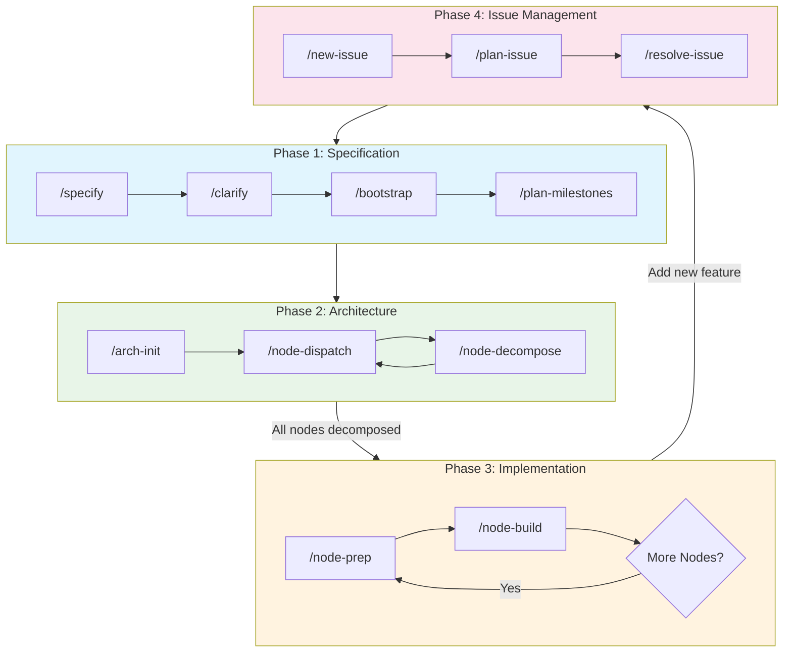

# Code Agent Toolkit

> A structural, frontier-driven workflow for building large software systems with AI agents — without collapsing into linear context overload.

---

## Overview

This toolkit provides a collection of Claude Code skills that implement a two-tier architectural model:

- **Outer Tier (Rare, Structural)**: Architecture decisions made infrequently
- **Inner Tier (Frequent, Local)**: Test-driven implementation of individual components

The workflow enforces strict TDD discipline and prevents context overload by keeping each iteration small, local, and bounded.

---

## Skills

### Specification & Planning

| Skill | Description |
|-------|-------------|
| [specify](skills/specify/) | Creates or updates project specifications (SPEC.md) |
| [clarify](skills/clarify/) | Resolves ambiguous areas in specifications through targeted questions |
| [bootstrap](skills/bootstrap/) | Bootstraps new projects with tech stack selection and hello-world baseline |
| [plan-milestones](skills/plan-milestones/) | Plans implementation milestones from specification |

### Architecture

| Skill | Description |
|-------|-------------|
| [arch-init](skills/arch-init/) | Initializes architecture documentation with root node |
| [node-decompose](skills/node-decompose/) | Decomposes architecture nodes into child components |
| [node-dispatch](skills/node-dispatch/) | Selects next pending node relevant to current milestone |
| [node-prep](skills/node-prep/) | Prepares nodes with skeleton code and failing tests |
| [node-build](skills/node-build/) | Implements prepared nodes following TDD workflow |

### Issue Management

| Skill | Description |
|-------|-------------|
| [new-issue](skills/new-issue/) | Creates feature request or bug report documents |
| [plan-issue](skills/plan-issue/) | Creates task roadmap with TDD discipline |
| [resolve-issue](skills/resolve-issue/) | Executes issue resolution in batches with review checkpoints |

---

## Workflow



### Phase 1: Specification

```
specify → clarify → bootstrap → plan-milestones
```

1. **specify**: Create SPEC.md with requirements
2. **clarify**: Resolve ambiguities
3. **bootstrap**: Select tech stack and create baseline project
4. **plan-milestones**: Break into manageable milestones

### Phase 2: Architecture

```
arch-init → node-dispatch → node-decompose (repeat)
```

1. **arch-init**: Initialize architecture documentation
2. **node-dispatch**: Find next pending node for current milestone
3. **node-decompose**: Decompose node into children

Repeat until architecture is fully decomposed.

### Phase 3: Implementation

```
node-prep → node-build (repeat for each node)
```

1. **node-prep**: Generate skeleton + failing tests (TDD - red state)
2. **node-build**: Implement to make tests pass (green state)

### Phase 4: Issue Management

For bug fixes or feature requests:

```
new-issue → plan-issue → resolve-issue
```

1. **new-issue**: Document the issue
2. **plan-issue**: Create task roadmap with TDD
3. **resolve-issue**: Execute in batches with checkpoints

---

## Node State Model

Architecture nodes progress through these states:

| State | Meaning |
|-------|---------|
| `pending` | Awaiting decomposition |
| `decomposed` | Has child nodes defined |
| `atomic` | Leaf node, should not decompose further |
| `prepared` | Skeleton + failing tests created |
| `implemented` | Logic implemented, tests passing |
| `deferred` | Not part of current milestone |
| `stubbed` | Placeholder for deferred dependencies |

---

## Key Principles

- **Architecture out of iteration loop** - Structure is fixed; implementation is iterative
- **One-level decomposition** - Only decompose one level at a time to prevent context explosion
- **TDD enforced** - Tests must fail before implementation; never weaken tests to make them pass
- **Bounded scope** - Each iteration is small, local, and context-efficient

---

## Usage

Invoke skills directly using `/skill-name`:

```
/specify build a todo app
/bootstrap Python
/plan-milestones MVP first
/node-prep
/node-build
/new-issue add dark mode
/plan-issue 001
/resolve-issue 001
```

---

## Scripts

- `scripts/security_scan_all.py` - Run security scans on all skills

```bash
uv run scripts/security_scan_all.py
```
